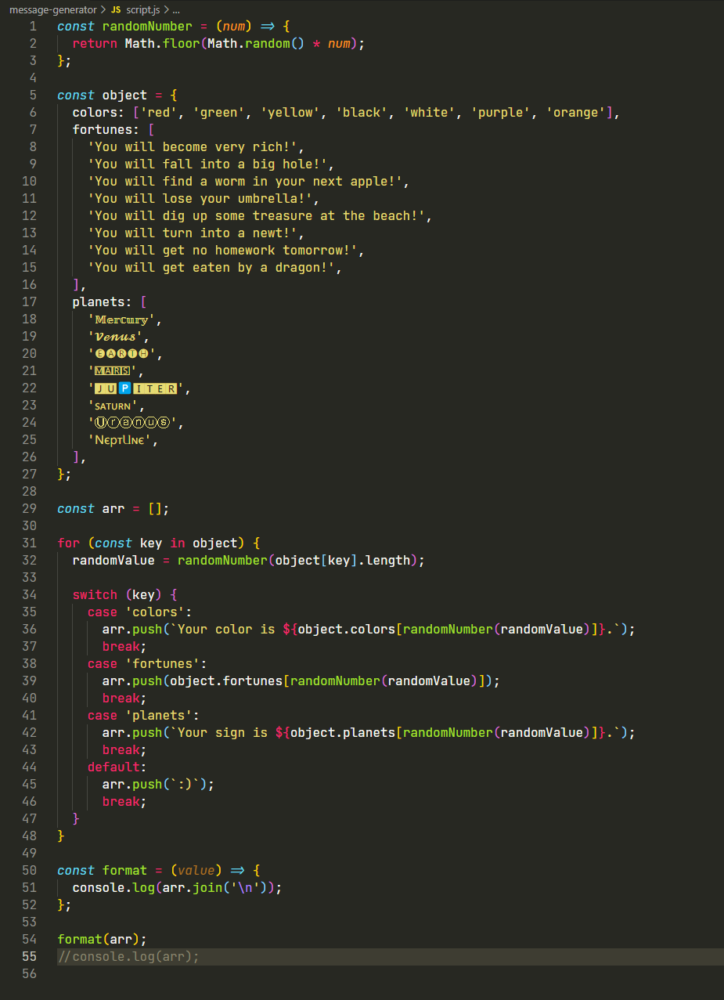

# Message Generator

## Table of Contents

- [General Info](#general-information)
- [Technologies Used](#technologies-used)
- [Screenshots](#screenshots)
- [Project Status](#project-status)
- [Contact](#contact)

## General Information

- This project is a simple message generator. Every time a user runs a program, they get a new, randomized output.

## Technologies Used

- JavaScript.

## Screenshots

## Project Status

Project is: _complete_.

## Contact

Created by Mykhailo.
